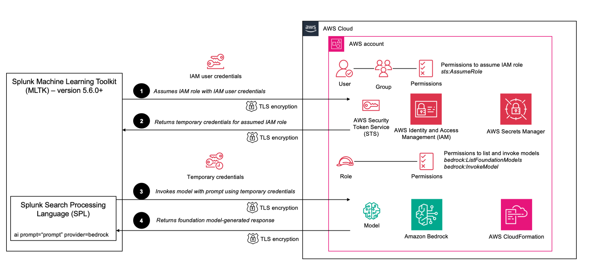

# Amazon Bedrock Integration for Splunk Machine Learning Toolkit (MLTK)

**This integration connects Splunk's Machine Learning Toolkit (MLTK) with Amazon Bedrock's foundation models, enabling analysts to extract insights from machine data using generative AI within familiar Splunk workflows. By bringing generative AI capabilities directly into Splunk Search Processing Language (SPL) searches, security teams can accelerate investigations, operations teams can streamline root cause analysis, and business teams can generate narrative explanations from technical data, all without specialised AI expertise.**

## Table of Contents

- [Introduction](#introduction)
- [Solution Overview](#solution-overview)
- [What Gets Deployed](#what-gets-deployed)
- [How It Works](#how-it-works)
  - [Authentication and Data Flow](#authentication-and-data-flow)
  - [AWS Services Used](#aws-services-used)
- [Costs](#costs)
- [Getting Started](#getting-started)
  - [Prerequisites](#prerequisites)
  - [Quick Deployment](#quick-deployment)
  - [Step-by-Step Deployment](#step-by-step-deployment)
  - [Splunk Configuration](#splunk-configuration)
- [Testing](#testing)
  - [Simple Test](#simple-test)
  - [Additional Example Use Cases](#additional-example-use-cases)
    - [HTTP Status Code Analysis](#http-status-code-analysis)
    - [Advanced Threat Modelling from 400 Bad Request Errors](#advanced-threat-modelling-from-400-bad-request-errors)
- [Security Considerations](#security-considerations)
- [Common Issues and Solutions](#common-issues-and-solutions)
- [Uninstalling the Solution](#uninstalling-the-solution)
- [Additional Resources](#additional-resources)
- [License](#license)
- [Contributing](#contributing)
- [Code of Conduct](#code-of-conduct)

## Introduction

This integration brings the power of generative AI to your Splunk platform by connecting Splunk's [Machine Learning Toolkit (MLTK)](https://docs.splunk.com/Documentation/MLApp) with advanced foundation models hosted on [Amazon Bedrock](https://aws.amazon.com/bedrock/). Using this integration, Security, DevOps, and Business Intelligence teams can now leverage foundation models directly within their Splunk workflows to:

- **Accelerate Security Investigations**: Intelligently identify security risks, summarise key findings, and generate natural language explanations of potential threats detected in your environments
- **Streamline Root Cause Analysis**: Transform complex machine-generated events into clear, actionable insights without manual parsing
- **Enhance Business Intelligence**: Generate narrative explanations, create executive summaries from data trends, and translate technical metrics into business-friendly insights

By combining Splunk's powerful data processing capabilities with Amazon Bedrock's state-of-the-art foundation models, such as [**Amazon Nova**](https://aws.amazon.com/ai/generative-ai/nova/), teams can reduce incident resolution time, improve operational efficiency, and unlock deeper insights from their Splunk data.

> 🧠 **Amazon Nova**: In these examples, we will be using the Amazon Nova Lite model that offers powerful multimodal capabilities for processing text, image, and video inputs while balancing performance and cost-effectiveness.

## Solution Overview

The provided [AWS CloudFormation template](./cfn/template.yaml) creates all the necessary AWS resources to allow [Splunk Machine Learning Toolkit (MLTK) version 5.6.0](https://docs.splunk.com/Documentation/MLApp/5.6.0/User/Whatsnew) and above to securely connect with foundation models hosted on Amazon Bedrock.

## What Gets Deployed

The [CloudFormation template](./cfn/template.yaml) deploys the following resources:

- [AWS Identity and Access Management (IAM)](https://aws.amazon.com/iam/) User dedicated to the Splunk MLTK integration
- IAM group that contains the dedicated IAM user
- IAM role with permissions limited to only the necessary Amazon Bedrock model actions
- IAM policies implementing principles of least-privilege:
  - IAM group policy only permitting the ability to assume the IAM role
  - IAM role policy only permitting the ability to list foundation models, and invoke the selected model
- [AWS Secrets Manager](https://aws.amazon.com/secrets-manager/) secret containing IAM user credentials for initial configuration

## Costs

This solution configures access to Amazon Bedrock models, which incur usage-based costs in your AWS account based on the model selected and tokens consumed. For current pricing information, see the [Amazon Bedrock pricing page](https://aws.amazon.com/bedrock/pricing/). The [AWS Pricing Calculator for Amazon Bedrock](https://calculator.aws/#/createCalculator/bedrock) can also be used to estimate charges.

Amazon Bedrock enforces service quotas. If you anticipate high usage, consider requesting a quota increase through the [AWS Service Quotas](https://docs.aws.amazon.com/servicequotas/latest/userguide/request-quota-increase.html) console. For detailed quota information, see [Amazon Bedrock Quotas](https://docs.aws.amazon.com/bedrock/latest/userguide/quotas.html).

## How It Works


*Diagram showing integration between Splunk MLTK and Amazon Bedrock*

### Authentication and Data Flow

The following table outlines the authentication and data flow between Splunk MLTK and Amazon Bedrock:

| Step | Title                                                                            | Description                                                                                                                                                                                                                                                                                                                                                                                                             |
|:----:|----------------------------------------------------------------------------------|-------------------------------------------------------------------------------------------------------------------------------------------------------------------------------------------------------------------------------------------------------------------------------------------------------------------------------------------------------------------------------------------------------------------------|
| **1** | **Splunk MLTK assumes IAM role using IAM user credentials**                      | Splunk MLTK (version 5.6.0+) uses IAM user credentials to make an `AssumeRole` API call to [AWS Security Token Service (STS)](https://docs.aws.amazon.com/STS/latest/APIReference/welcome.html). This IAM user belongs to an IAM group with permissions restricted to only the `AssumeRole` action and cannot directly access any other AWS service.                                                                    |
| **2** | **AWS STS returns temporary credentials for the assumed IAM role**               | AWS STS validates the authentication request against the IAM role's trust policy and generates temporary security credentials.                                                                                                                                                                                                                                                                                          |
| **3** | **Splunk MLTK invokes foundation model with prompt using temporary credentials** | Splunk MLTK uses the temporary credentials to make API calls to Amazon Bedrock, sending the user's prompt to the selected foundation model.                                                                                                                                                                                                                                                                             |
| **4** | **Amazon Bedrock returns foundation model-generated response**                   | Amazon Bedrock processes the prompt using the selected foundation model and returns the generated response back to MLTK. The response is integrated into Splunk's search results, allowing users to use the AI-generated content alongside Splunk's [Search Processing Language (SPL)](https://docs.splunk.com/Documentation/Splunk/latest/Search/Aboutthesearchlanguage) using the new `\| ai prompt="prompt"` command. |

### AWS Services Used

The integration leverages several AWS services to provide access to Amazon Bedrock:

| AWS Service | Description                                                                                                      |
|-------------|------------------------------------------------------------------------------------------------------------------|
| **AWS CloudFormation** | Provisions all required resources for this integration automatically using Infrastructure-as-Code (IaC)          |
| **AWS Secrets Manager** | Stores IAM user credentials for initial setup                                                                    |
| **AWS IAM** | Enforces the identity-based security controls through the IAM user, IAM group, IAM role and related IAM policies |
| **AWS STS** | Provides temporary, time-limited credentials through the IAM role assumption process                             |
| **Amazon Bedrock** | Processes natural language prompts using foundation models and generates responses                               |

## Getting Started

### Prerequisites

Before getting started, ensure you have:
- [ ] AWS account with permissions to deploy and configure the [necessary AWS resources](#AWS-Services-Used)
- [ ] Splunk Enterprise or Splunk Cloud with [Splunk MLTK 5.6.0](https://docs.splunk.com/Documentation/MLApp/5.6.0/User/Whatsnew) or later installed. You can upgrade this app using Splunk's **Manage Apps**.
- [ ] Splunk Python for Scientific Computing 4.2.3 or laster installed. You can upgrade this app using Splunk's **Manage Apps**.
- [ ] Foundational model you are planning to use enabled in AWS's Amazon Bedrock **Model access** console. To enable models, visit the Amazon Bedrock console, navigate to **Model access**, and request access to your desired models.

  
  *Amazon Bedrock console showing model access for Amazon Nova Lite*

- [ ] Admin access to Splunk MLTK (requires `mltk_admin` permissions)

  
  *Splunk user roles showing `mltk_admin` role required for integration*

### Quick Deployment

For experienced users who want to get up and running quickly:

1. Deploy the [CloudFormation template](./cfn/template.yaml)
2. Retrieve IAM user credentials and IAM role ARN from the Secrets Manager secret created
3. Configure Splunk MLTK Bedrock integration to use the IAM user credentials and IAM role in Splunk MLTK App's **Connection Management** tab
4. Run a [test SPL query](#Simple-Test) using the `ai` SPL command

### Step-by-Step Deployment

This process typically takes approximately 5-10 minutes to complete.

1. Log in to your AWS account
2. Navigate to the CloudFormation console
3. Select **Create stack** (**With new resources (standard)**). Upload and use the [CloudFormation template](./cfn/template.yaml) provided.
4. Provide the **Model ID** of the chosen [foundation model](https://docs.aws.amazon.com/bedrock/latest/userguide/models-supported.html) (e.g., `amazon.nova-lite-v1:0` for [**Nova Lite**](https://aws.amazon.com/ai/generative-ai/nova/)). You can find model IDs listed in the [Supported foundation models in Amazon Bedrock page](https://docs.aws.amazon.com/bedrock/latest/userguide/models-supported.html).

  
  *CloudFormation console showing user-specified parameters*

5. Once the CloudFormation stack is deployed, note down the ID of the generated Secrets Manager secret shown in the stack's outputs

  
  *CloudFormation console showing successful deployment of the template*

> 🔒 **Secrets Manager secret**: After configuring Splunk MLTK with the credentials and testing the integration, you can safely delete the Secrets Manager secret to ensure no-one else can have access to it within the AWS environment, and to eliminate [ongoing charges](https://aws.amazon.com/secrets-manager/pricing/). You can always regenerate a new secret in the future if required.

### Splunk Configuration

This configuration typically takes approximately 5-10 minutes to complete.

1. In Splunk MLTK, navigate to **Connection Management**. If this tab does not exist, ensure that you have MLTK version 5.6.0 or above.
2. Select **Bedrock** from the **Select Service** dropdown

  
  *Selecting Amazon Bedrock as the service provider in Splunk MLTK Connection Management*

3. Access the generated secret from Secrets Manager console using the ID from the CloudFormation stack outputs

After retrieving the secret from Secrets Manager, you'll need to map specific values to the Splunk MLTK configuration fields:

| Splunk MLTK Field     | AWS Secrets Manager Secret Value   | Description                                              |
|-----------------------|-----------------------------------|----------------------------------------------------------|
| **Region**            | `awsRegion`                       | AWS Region where your Amazon Bedrock models are deployed |
| **AWS Access Key Id** | `accessKeyId`                     | IAM user access key ID created by CloudFormation         |
| **AWS Access Token**  | `secretAccessKey`                 | IAM user secret access key created by CloudFormation     |
| **Role Arn**          | `roleArn`                         | ARN of the IAM role that Splunk will assume              |

4. Populate the following fields in **Settings for Provider Bedrock**:
   - **Region**: The AWS Region (`awsRegion`) from the secret (e.g., `us-east-1`)
   - **AWS Access Key ID**: The access key (`accessKeyId`) ID from the secret
   - **AWS Access Token**: The secret access key (`secretAccessKey`) from the secret
   - **Role ARN**: The role ARN (`roleArn`) from the secret
5. Adjust an appropriate **Request Timeout** if required (default: `200`)
6. Select your chosen model from the **Select Model** dropdown (e.g., `amazon.nova-lite-v1:0`). This must match the model ID provided during the CloudFormation stack deployment.

> ⚠️ **Models Not Populating?**: If the **Select Model** dropdown is not populating at this stage, confirm that your IAM configuration, including the IAM user's credentials, are correct.

7. Once a model has been selected, adjust the **Settings for Model** as required (e.g., **Response Variability** of `0.5`)
8. Select **Set as default**
9. **Save** your connection settings

  
  *Amazon Bedrock Connection Management settings page in Splunk MLTK showing input fields*

10. You are now ready to test this integration.

## Testing

> ✔️️ **Amazon Bedrock Model Access**: Model access in Amazon Bedrock requires model approval in your AWS account before use. Confirm this using Bedrock's **Model access** page.

You are now ready to use Splunk MLTK's `ai` command to interact with Amazon Bedrock models.

### Simple Test

Below is a simple example demonstrating the interaction with Bedrock.

```splunk
| makeresults 
| eval prompt="What is Amazon Bedrock?"
| ai prompt={prompt}
```


*Example of Splunk search results using the `ai` command with Amazon Bedrock integration*

Refer to Splunk's [prompt patterns document](https://docs.splunk.com/Documentation/MLApp/latest/User/Aboutaicommand#Prompt_patterns) for advanced usage of prompts within SPL.

For tips on how to write good prompts, visit the [Amazon Bedrock Prompt Engineering Concepts](https://docs.aws.amazon.com/bedrock/latest/userguide/prompt-engineering-guidelines.html) page.

### Additional Example Use Cases

Before trying these examples, make sure to follow the instructions on the [Splunk Search Tutorial page](https://docs.splunk.com/Documentation/Splunk/latest/SearchTutorial/GetthetutorialdataintoSplunk) to download and install the `tutorialdata.zip` file. These examples use the *Buttercup Games* dataset that comes with this tutorial package.

> ℹ️ **Important**: When you are running these queries, ensure that the **Time range** is set to a value that covers the data stored in the index. Otherwise, you will not see the results.

> 💲 **Cost Management**: Before using the `ai` command, always test your preceding SPL query to understand how many foundation model requests will be generated. Each row in your search results will trigger a separate call to Amazon Bedrock, which incurs charges.
> 
> Best practices:
> - Use commands like `stats`, `dedup`, or `head` to reduce your result set before the `ai` command
> - In our examples, we use `stats` to group results first, minimising the number of API calls
> - For testing, consider using `| head 5` to limit results to just a few rows
> - Consider scheduling your queries to run automatically for predictable and controlled foundation model usage
> - Use the **Maximum Result Rows** and **Max Tokens** [settings](https://docs.splunk.com/Documentation/MLApp/latest/User/Aboutaicommand#Configuration_steps) of your model in Splunk MLTK’s **Connection Management** tab to restrict the amount of data sent to Amazon Bedrock
>
> Furthermore, while Secrets Manager is used to securely store IAM credentials during initial configuration, you can safely delete the secret after Amazon Bedrock integration is configured to eliminate [ongoing charges](https://aws.amazon.com/secrets-manager/pricing/).

#### HTTP Status Code Analysis

This simple example shows how a foundation model can transform raw HTTP status codes into actionable security insights for Security Operations Centre (SOC) analysts:

```splunk
source="tutorialdata.zip:./www*"
| stats count by status
| ai prompt="You are a Security Operations Centre (SOC) analyst compiling a daily report. Analyse the HTTP status code {status} with a count of {count}. Provide a short description and common cause for the HTTP status code, and whether it should be a priority for a security investigation. Provide the information in the following format: HTTP Status Code:, Count:, Description:, Common Cause:, Investigation Priority: (separated by new lines). No more than 100 words in total. Keep it factual."
| fields status, count, ai_result_1
```

In this example:

- We extract unique HTTP status codes from web server logs
- We count occurrences by each distinct status code
- We prompt the foundation model to provide security-focused explanations of each status code

This approach can potentially help SOC analysts quickly prioritise which HTTP status codes deserve immediate attention without manually researching each one, accelerating threat detection and response.


*Example of Splunk search results using the `ai` command for HTTP status code analysis*

#### Advanced Threat Modelling from 400 Bad Request Errors

This example demonstrates how to use the foundation model to perform deeper security analysis on client error logs:

```splunk
source="tutorialdata.zip:./www*"
| search status=400
| table _raw
| stats list(_raw) as logs
| ai prompt="You are a Security Operations Centre (SOC) analyst performing threat modelling. Analyse the following log entries: {logs}. List the top 5 notable findings in a clearly formatted list, along with recommended actions for each. Focus the most on a) issues that are most prevalent, and b) those with the highest risk, and justify the reasons for the priority. Also substantiate these findings with metrics (such as number of occurrences or URL paths) or other notable information (such as web server, IP address, URL path, etc). No more than 400 words in total. Note that this is a list of entries with only HTTP 400 errors so 100% HTTP 400 error should not be a valid finding. Mask the first 6 digits of any IP addresses returned in the output, for example 123.123.123.123 should be shown as XXX.XXX.123.123. Don't make any assumptions, keep it factual."
| fields ai_result_1
```

In this example:

- We focus specifically on HTTP 400 (`Bad Request`) errors which often indicate client-side issues
- We combine and inspect the raw log entries containing complete request details
- We ask the foundation model to perform threat modelling analysis on the combined log entries
- We request prioritised findings and recommendations based on prevalence and risk factors

This search has the potential to help security teams quickly identify potential malicious activity that would normally require manual log review and security expertise to detect.


*Example of Splunk search results using the `ai` command for threat modelling*

## Security Considerations

Here are security considerations for the solution:

- Credentials are securely stored in Secrets Manager for initial retrieval during integration. You are encouraged to [rotate them frequently](https://docs.aws.amazon.com/secretsmanager/latest/userguide/best-practices.html).
- The IAM user is assigned to an IAM group that has an IAM policy permitting a single action (`sts:AssumeRole`). This follows security best practices by assigning permissions to groups rather than directly to users, and restricts the IAM user to assuming only the integration Bedrock IAM role
  - The IAM role also includes a trust policy that only allows assumption of this IAM role by the integration IAM user
- The IAM role has an IAM policy with restricted permissions (`bedrock:ListFoundationModels` to list all available models, and `bedrock:InvokeModel` to invoke only the chosen foundation model)
- Temporary credentials issued by AWS STS have a limited lifespan ([default 12 hours for IAM users](https://docs.aws.amazon.com/STS/latest/APIReference/API_GetSessionToken.html))
- All communication with Bedrock uses TLS 1.2 or higher with Perfect Forward Secrecy (PFS) cipher suites, ensuring data encryption in transit ([Amazon Bedrock infrastructure security documentation](https://docs.aws.amazon.com/bedrock/latest/userguide/infrastructure-security.html))
- Before implementing this solution, validate what data will be included in your `ai` prompts and ensure its use complies with your organisation's data governance policies. Data processed by foundation models hosted on Amazon Bedrock is sent outside your Splunk environment.
- All of these configurations are consistently deployed when using the CloudFormation template

## Common Issues and Solutions

Listed below are commonly encountered issued and resolutions:

- If Splunk MLTK integration with Splunk fails, verify that you have all the [prerequisites](#Prerequisites) in place
- Ensure that your foundation model is enabled for use in your AWS Region (from **Amazon Bedrock** console > **Model access**).
  - Confirm that the model ID of the chosen model matches what was specified during CloudFormation deployment.
- Test your SPL without the `ai` command first to ensure you understand exactly what data is being selected for your prompt
- Verify that the Splunk user you are using has the `mltk_admin` role in Splunk

## Uninstalling the Solution

To avoid ongoing charges, delete the CloudFormation stack once you no longer require the integration.

## Additional Resources

- [CloudFormation Template](./cfn/template.yaml)
- [Splunk MLTK 5.6.0 What's New Documentation](https://docs.splunk.com/Documentation/MLApp/5.6.0/User/Whatsnew)
- [Amazon Bedrock Documentation](https://docs.aws.amazon.com/bedrock/)
- [Amazon Bedrock Prompt Engineering Concepts](https://docs.aws.amazon.com/bedrock/latest/userguide/prompt-engineering-guidelines.html)

## Acknowledgments

Special thanks to the following individuals who contributed to this documentation:

- Alan Peaty, Senior Partner Solutions Architect, AWS
- Varun Rajan, Senior Solutions Architect, AWS
- Greg Ainslie-Malik, Field CTO, Splunk

## License

See [LICENSE.md](./LICENSE.md) for details.

## Contributing

Please read [CONTRIBUTING.md](./CONTRIBUTING.md) for details on our code of conduct and the process for submitting pull requests.

## Code of Conduct

Please read [CODE_OF_CONDUCT.md](./CODE_OF_CONDUCT.md) for details on our code of conduct.